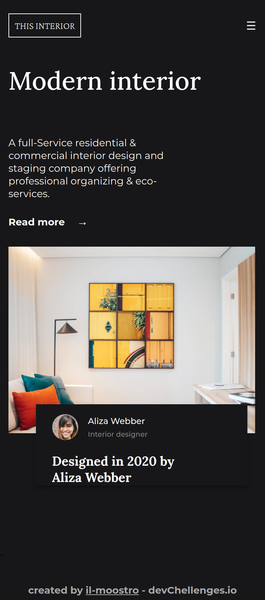

<h1 align="center">Interior consultant</h1>

   Solution for a challenge from  <a href="http://devchallenges.io" target="_blank">Devchallenges.io</a>.

  <h3>
    <a href="https://https://il-mostroo.github.io/DevChallengesio.interior-consultant-master/">
      Demo
    </a>
     | 
    <a href="https://devchallenges.io/challenges/Jymh2b2FyebRTUljkNcb">
      Challenge
    </a>
  </h3>

## Overview

This application/site was created as a submission to a [DevChallenges](https://devchallenges.io/challenges) challenge. The [challenge](https://devchallenges.io/challenges/Jymh2b2FyebRTUljkNcb) was to build an application to complete the given user stories.

It was a very good challenge for me as i implemented for the first time a collapsing menu for small screens.

### Built With

- Html
- Css
- Javascript

## Contact

- GitHub [@your-username](https://github.com/il-moostro)
